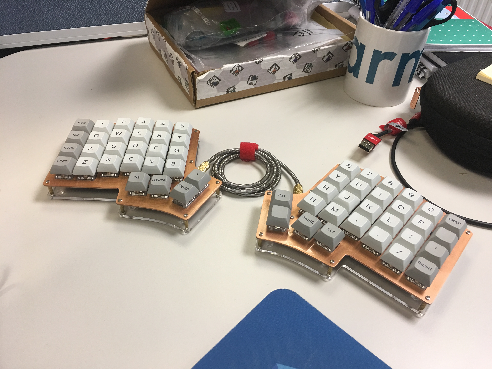

# Iris Split Mechanical Keyboard Build
This is the repo for my Iris Mechanical Keyboard Build. Here you can find the images taken during the build, the source code for the QMK firmware (coming soon!), and more information about the build.

The build itself has a brushed copper plate, acrylic base, Zealios v2 67g tactile switches, Iris Rev2 PCBs, and green LEDs to give a Copper Oxide effect without the rust.

- The blog post and build log can be found [here](https://lukegeeson.com/blog/2019-07-17-Iris-Split-Mech-Keyboard-Build/).
- Links to the images can be found [here](images/).
- Link to the QMK space cadet Iris Firmware (coming soon!)
- Link to the switch plate design file (for laserboost) can be found [here](./iris-switch-plate.dxf)

## Build List
## Build Log
## 