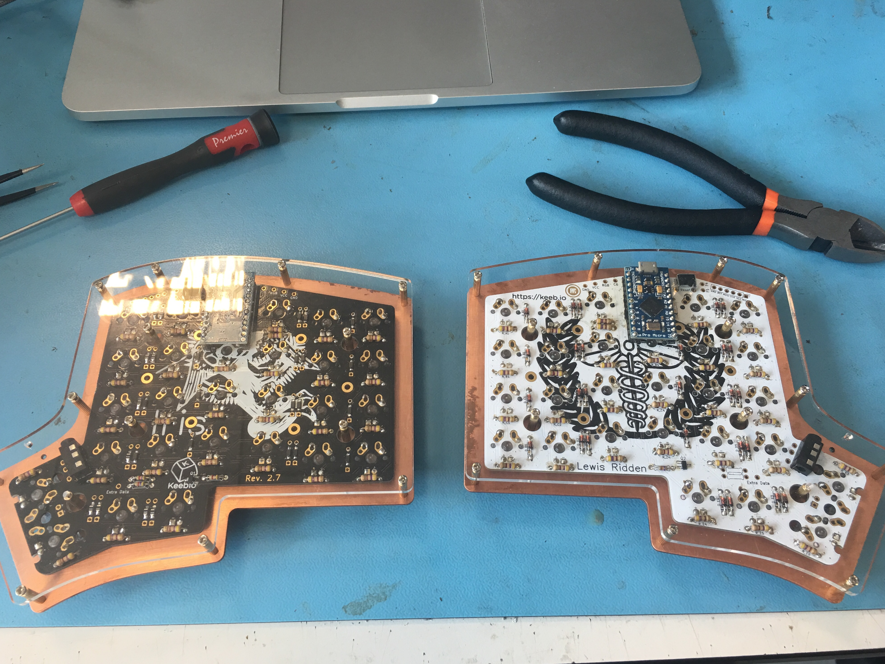

# Iris Split Ergonomic Mechanical Keyboard Build
I’ve been experimenting with ergonomic set-ups and the wonders of mechanical keyboards, and so I decided to build my own!

This is the repo for my Iris Mechanical Keyboard Build. Here you can find the images taken during the build, the source code for the QMK firmware (coming soon!), and more information about the build.

The build itself has a brushed copper plate, acrylic base, Zealios v2 67g tactile switches, Iris Rev2 PCBs, and green LEDs to give a Copper Oxide effect without the rust.

- The blog post and build log can be found [here](https://lukegeeson.com/blog/2019-07-17-Iris-Split-Mech-Keyboard-Build/).
- Links to the images can be found [here](images/).
- Link to the QMK space cadet Iris Firmware (coming soon!)
- Link to the switch plate design file can be found [here](./iris-switch-plate.dxf)

## Build List
To build this you will need the following:

1. Iris [PCBs Rev 2](https://keeb.io/products/iris-keyboard-split-ergonomic-keyboard), All Iris PCBs for MX switches will work.
2. Brushed Copper Switch Plates, custom made by [laserboost](https://www.laserboost.com/keyboards) using the `iris-switch-plate.dxf` file.
3. [Zealios v2](https://zealpc.net/products/zealio) 67g Tactile switches, Or any other MX compatible switch you prefer.
4. Signature Plastics DSA profile dye-sublimated [key caps](https://pimpmykeyboard.com/dsa-sublimated-keysets/) in off-white and grey (GEK and GKK). 
5. 2x [Elite-C USB C micro-controller](https://spacecat.design/products/elite-c-usb-c-pro-micro-replacement) to drive the boards.
6. 2x [Acrylic base](https://keeb.io/products/iris-keyboard-case-plates?variant=29417785983070)
7. 60x 1.8mm [Green through-hole LEDs](https://www.ebay.co.uk/itm/281491590196). This is optional if you want LEDs
8. 60x 1N4148TR [Diodes](https://uk.farnell.com/on-semiconductor/1n4148tr/diode-100v-200ma-do-35/dp/9843680?CMP=i-ddd7-00001003)
9. 60x Carbon Film [Resistors](https://www.ebay.co.uk/itm/Carbon-Film-Resistors-1-4W-0-25W-Full-Range-of-Values-Various-Pack-Sizes/152059712084?hash=item2367771254:m:mmv0u0bUeNDzAHY6xUyeLew) 1/4W 0.25W
10. [TRRS](https://keeb.io/collections/split-keyboard-parts/products/trrs-cable?variant=46391966598) cable
11. LED [add-on](https://keeb.io/products/led-support-components-add-on?_pos=1&_sid=ca08f142f&_ss=r) kit (MOSFETs etc...). This is optional if you want LEDs.
12. A micro USB cable
13. Optional LED [strip](https://keeb.io/products/rgb-led-strips-sk6812-ws2812b-compatible) for under-glow

The build also assumes you have:

- Access to a soldering iron, (lead-free) solder, an extractor
- Access to pliers to cut the spare wires
- A solder sucker if you make mistakes
- Some handy screwdrivers
- A machine to flash QMK onto the board, with a recent version of GCC to compile as needed.

## Build Log

The build log is on my [blog](https://lukegeeson.com/blog/2019-07-17-Iris-Split-Mech-Keyboard-Build/) along with a thorough look into the build, process, and more!

## 